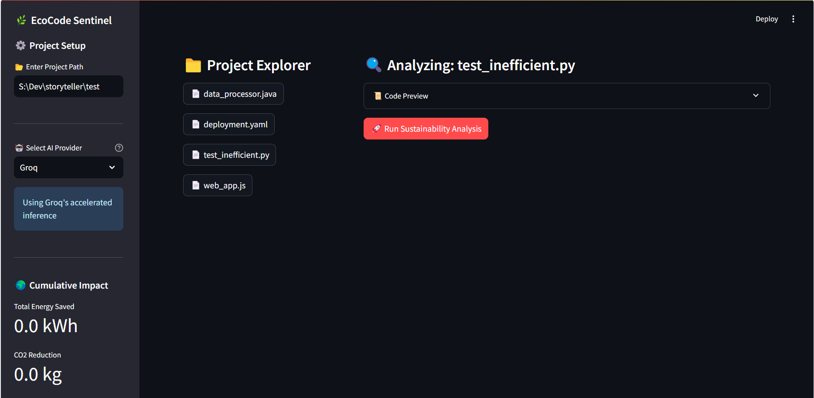

# EcoCoder Analyzer 🌿

**EcoCoder Analyzer** is a Streamlit-powered web application that analyzes code for energy efficiency and sustainability using Groq's high-performance LLM. It provides actionable insights, optimized code suggestions, and visualizations of environmental impact.

  


---

## Features ✨

- **Code Sustainability Analysis**:
  - Estimates energy consumption and CO₂ emissions
  - Provides detailed breakdown of environmental impact
- **AI-Powered Optimizations**:
  - Suggests energy-efficient code improvements
  - Displays optimized code with explanations
- **Interactive Visualizations**:
  - Energy consumption comparison charts
  - Cumulative environmental impact tracking
- **File Explorer**:
  - Browse and analyze files in your project directory
  - Supports nested directory structures
- **Cumulative Impact Tracking**:
  - Tracks total energy savings and CO₂ reductions across analyses

---

## Installation 🛠️

### Prerequisites
- Python 3.8+
- Groq API Key (sign up at [Groq Cloud](https://groq.com/))

### Steps
1. Clone the repository:
   ```bash
   git clone https://github.com/aitiwari/ecocoder-analyzer.git
   cd ecocoder-analyzer
   ```

2. Install dependencies:
   ```bash
   pip install -r requirements.txt
   ```

3. Create a `.env` file in the project root:
   ```env
   GROQ_API_KEY=your_groq_api_key_here
   ```

4. Run the application:
   ```bash
   streamlit run app.py
   ```

---

## Usage 🚀

1. **Set Project Directory**:
   - Enter the path to your codebase in the sidebar
   - Browse files using the interactive file explorer

2. **Analyze Code**:
   - Select a file to analyze
   - Click the "🌿 Analyze Sustainability Impact" button

3. **Review Results**:
   - View energy and CO₂ impact metrics
   - Explore optimized code suggestions
   - Check cumulative environmental savings

---

## Configuration ⚙️

### Environment Variables
| Variable         | Description                          | Default |
|------------------|--------------------------------------|---------|
| `GROQ_API_KEY`   | Your Groq API key                   | None    |

### Constants (in `app.py`)
| Constant             | Description                          | Default Value |
|----------------------|--------------------------------------|---------------|
| `CO2_PER_KWH`        | CO₂ emissions per kWh (kg)          | 0.475         |
| `AVG_SERVER_POWER`   | Average server power consumption (W)| 500           |
| `DEFAULT_EXECUTIONS` | Default monthly code executions     | 1,000,000     |

---

## Tech Stack 🛠️

- **Frontend**: Streamlit
- **AI Backend**: Groq API
- **Visualization**: Plotly
- **File Handling**: Python `pathlib`, `python-magic`
- **Environment Management**: `python-dotenv`

---

## License 📄

This project is licensed under the MIT License - see the [LICENSE](LICENSE) file for details.

---

## Acknowledgments 🙏

- Groq for their high-performance LLM API
- Streamlit for the amazing app framework
- Plotly for beautiful visualizations

---

## Contact 📧

For questions or feedback, please reach out:

- **Author**: Sachin Tiwari
- **Email**: genaitiwari@gmail.com
- **GitHub**: [aitiwari](https://github.com/aitiwari)

---

**Happy Coding and Saving the Planet!** 🌍💻
